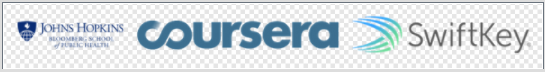
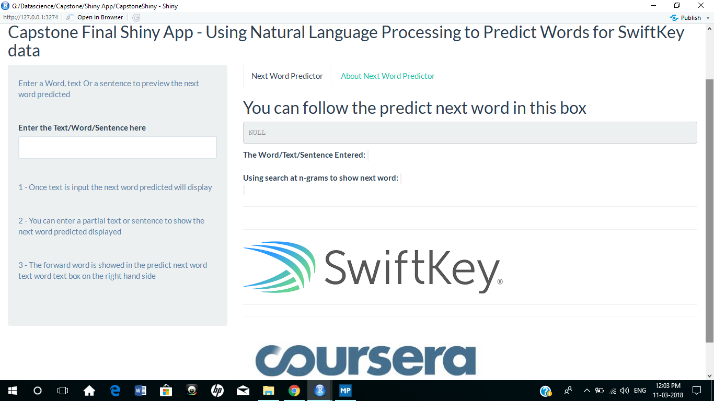

# Coursera Data Science Capstone Project #
This application is the capstone project for the Coursera Data Science specialization held by professors of the Johns Hopkins University and in cooperation with SwiftKey.

# The Objective #
The main goal of this capstone project is to build a shiny application that is able to predict the next word.

This exercise was divided into seven sub tasks like data cleansing, exploratory analysis, the creation of a predictive model and more.

All text data that is used to create a frequency dictionary and thus to predict the next words comes from a corpus prepared with data downloaded from [Swiftkey Data]((https://d396qusza40orc.cloudfront.net/dsscapstone/dataset/Coursera-SwiftKey.zip))

All text mining and natural language processing was done with the usage of a variety of well-known R packages.

# The Prediction Model #
After creating a data sample from the HC Corpora data, this sample was cleaned by conversion to lowercase, removing punctuation, links, white space, numbers and all kinds of special characters. This data sample was then tokenized into so-called [n-grams](en.wikipedia.org/wiki/N-gram)

Those aggregated bi-,tri- and quadgram term frequency matrices have been transferred into frequency dictionaries.

The resulting data.frames are used to predict the next word in connection with the text input by a user of the described application and the frequencies of the underlying n-grams table.

## Typical Rules Used ##

The following rules were applied for the prediction strategy and shiny app

For efficiently and exhaustively training and building a better model i have considered the following: 

####  Data Set Rules
- Increased set of documents (also one way would be to increase sample size) in order to have more higher order n-grams.

####  Word Rules
- Repeat the same process: Replace numbers, common abbreviations. Split sentences. Remove special characters (except apostrophes, for the reason mentioned before.) Tokenize the sentences and count words, bigrams, 3-grams, etc.

- Drop words and n-grams of low frequency (there are too many and they add little value and impact execution time)

- Avoiding to predict numbers and predict only words that may come after a number

- Spelling errors consideration can be avoided. We can use dictionary to check spelling error. 

- Profanity filtering-Use a standard list of profanity terms to filter profane terms

- Emoticons- Add rules to cleanup emoticons because emoticons are not required

####  Advanced Prediction
+ Trained the prediction algorithm based on n-grams (something very advanced like package with markov chain functionality)

+ Calculate probabiliites, add 1, backtrack.

####  Performance Efficiency

- Parallelise the coding so that data load and execution are parallelised
- Constantly measure memory and time- ie efficiently measure the usage of memory and time for the run and improve efficiency

# Usage of Next Word Predictor #

The usage of the Next Word Predictor Shiny app is very easy and simple

Just enter the set of words on the left frame and the next word is predicted on the right side Next Word Predictor Tab

You can see the details about the Next word predictor app in the "About Next Word Predictor" tab

* The Shiny application allow the prediction of the next possible word in a sentence. 

* The user entered the text in an input box, and in the other one, the application returns the most probable word to be used.

* The predicted word is obtained from the n-grams matrices, comparing it with tokenized frequency of 2, 3 and 4 grams sequences. 

* While entering the text, the field with the predicted next word refreshes instantaneously, and then the predicted word is then provided for the user's choice. 

# Location of the Application and Code #

The shiny application is available in the location [Next Word Predictor](https://rajajayaram.shinyapps.io/CapstoneShiny/)

The application code is available in the location [GITHUB Repo](https://github.com/rajajayaram/capstoneproject)

# Additional Information#

The milestone report is available in the loation [Milestone Report](http://www.rpubs.com/mmdaraja/capstonemilestonereport)

This pitch deck is located here: [Capstone Presentation]()

Learn more about the Coursera Data Science Specialization: [Coursera](www.coursera.org/specialization/jhudatascience/1)